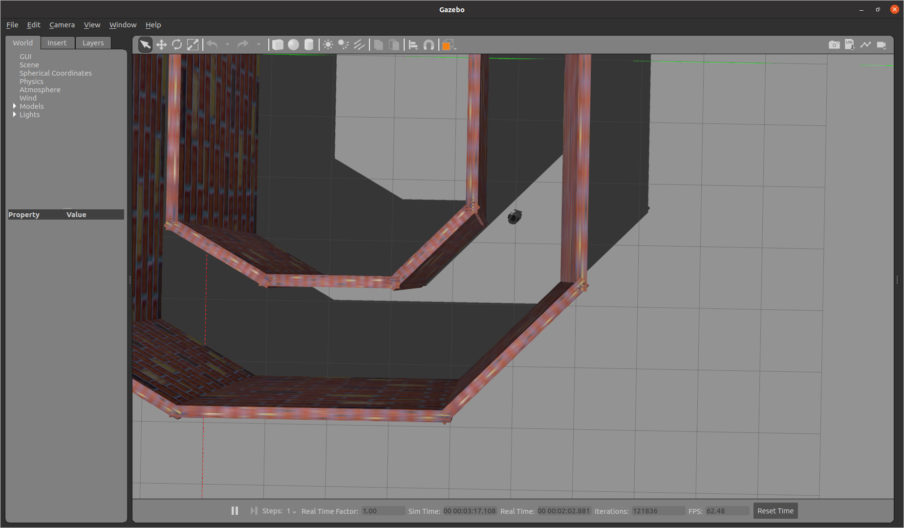
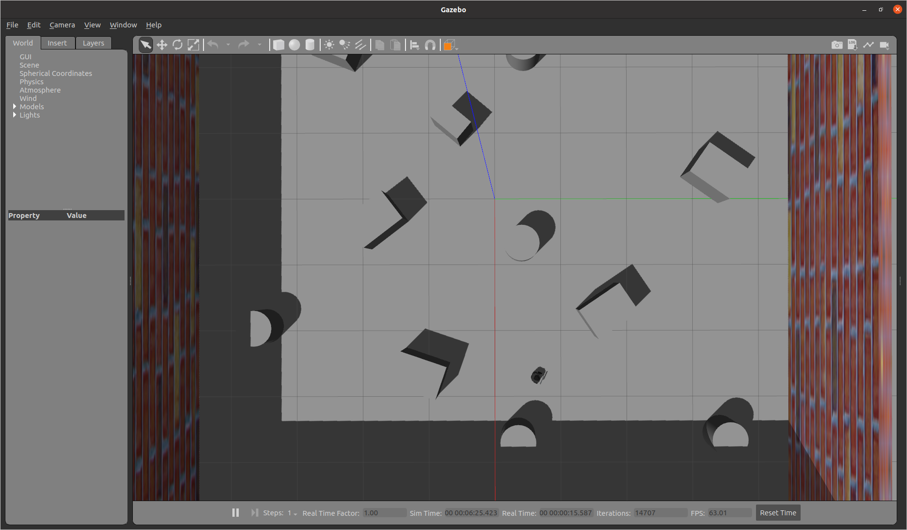
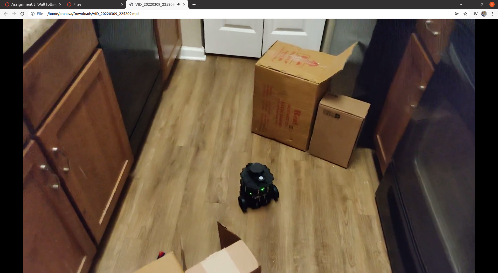

## Homework 3 submission

Package Name: assignment5_wallfollowingandobstacleavoidance  
ROS Version: Noetic  
Required Package: Gazebo

This package contains 2 different routines performed on the Turtlebot3 Burger in Gazebo Simulation and 1 more that is implemented in the real turtlebot3 burger.

### How to Run
Clone package folder into the catkin_workspace/src
$ catkin_make
$ roslaunch assignment5_wallfollowingandobstacleavoidance wall_following.launch # Replace the launch file name with any other

### Demo
1. wall_follower.py: Run the turtlebot in Gazebo with constant forward velocity while maintaining equal distances from the wall. A PD controller is implemented to keep the robot at the center between the walls.

2. wander.py: Run the turtlebot in Gazebo around the world provided while avoiding any obstacle

3. obstacle_avoidance_realworld.py: This routine is run with the real robot. This is an implementation of the wander.py adapted to run in the real world obstacles.

### Demo Videos
Videos folder inside the package contains demo runs of all the scripts.
