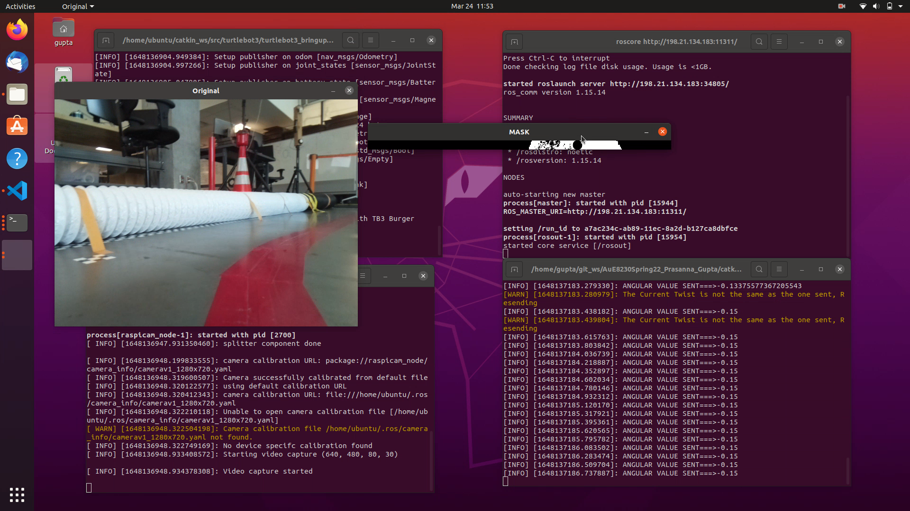

## Homework 6 submission

Package Name: assignment6_trackingandfollowing<br>
ROS Version: Noetic<br>
Required Packages: <br>
	1. gazebo<br>
	2. apriltag (AprilTag3)<br>
	3. apriltag_ros (3.1.2)<br>

Prerequisite:
 - Clone https://github.com/AprilRobotics/apriltag and https://github.com/AprilRobotics/apriltag_ros into your workspace.
 ```
 $ cd ~/catkin_workspace/
 $ cmake_isolated
 ```
 - To use the the routine that uses apriltag package, always include the setup.bash from devel_isolated together with the standard one:
 ```
 $ source devel/setup.bash
 $ source devel_isolated/setup.bash
 ```
This package contains one routine performed on the Turtlebot3 Burger in Gazebo Simulation and two routines implemented to perform in the Real life.

### How to Run
Clone package folder into the catkin_workspace/src
```
$ catkin_make
$ roslaunch assignment6_trackingandfollowing turtlebot3_follow_line.launch # Replace the launch file name with any other
```
###Special Instructions for AprilTag tracker - Routine 3:
Create 2 SSH terminals into the turtlebot. Run the following two in those separate shells<br>
```
$ roslaunch turtlebot3_bringup turtlebot3_robot.launch
```
Objective is to bringup the camera feed from the robot. This can be achieved using many ways. Make sure that the node name of the publisher is updated in all the files that use the camera feed.
```
$ roslaunch turtlebot3_bringup turtlebot3_rpicamera.launch
```
In Remote PC
```
$ roslaunch apriltag_ros continuous_detection.launch
```
### Demo
1. follow_line_step_hsv.py: Run the turtlebot in Gazebo with constant forward velocity while following the line in the 'follow_line.world' file. A PD controller is implemented to follow the lane.

2. follow_line_step_hsv_real.py: To run the 1st routine in the Real world


3. april_tag.py: Tracking an april tag of family 'Tag36h11' id:0 and maintains a constant distance of 0.3m. Make sure to follow the 'Prerequisite' and Special Instructions given above. Replace the files found in 'catkin_workspace/src/apriltag_ros/apriltag_ros/config' with the ones provided in the 'other_res' directory<br>


### Demo Videos
Videos folder inside the package contains demo runs of all the scripts in simulation and real world.

### Code Adaptability
For Lane Following:
- Currently the lane following bot can follow Red colored lane
- This can be derived by analyzing the hsv values received in the mask
- Our values in parts of the track where we observed the difficulties in masking: 105,101,156; 175,149,135; 144,185,193
- This step shall be repeated to adapt to a different color line.
For April Tag tracking:
- We used the default tag family. 
- In the selected family of tags, our detector can only detect of id:0
- To detect tags from different family make necessary changes to the settings.yaml and tags.yaml
