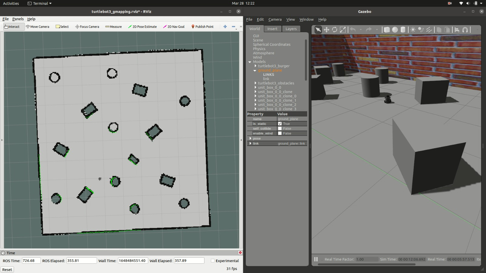
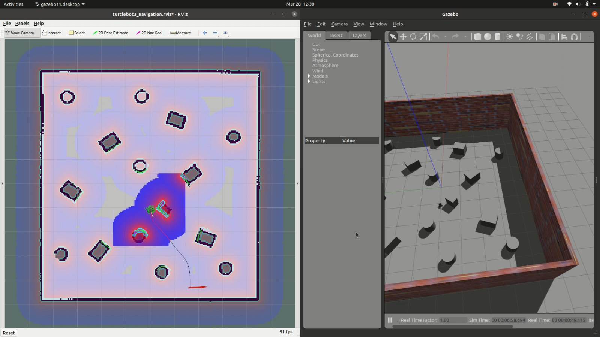

## Homework 7 submission

Package Name: assignment7<br>
ROS Version: Noetic<br>
Required Packages: <br>
	1. gazebo<br>
	2. turtlebot3_slam<br>

This package contains one routine performed on the Turtlebot3 Burger in Gazebo Simulation and two routines implemented to perform in the Real life.

### How to Run
Clone package folder into the catkin_workspace/src
```
$ catkin_make
$ roslaunch assignment7 gazebo_slam_LDS.launch # Replace the launch file name with any other
```
### Standard Routine to be followed when running on realbot
Create SSH terminal into the turtlebot. Run the following<br>
```
$ roslaunch turtlebot3_bringup turtlebot3_robot.launch
```
In Remote PC
1. Running Slam Node: https://emanual.robotis.com/docs/en/platform/turtlebot3/slam/#run-slam-node <br>
2. Running Navigation Node after mapping: https://emanual.robotis.com/docs/en/platform/turtlebot3/navigation/#run-navigation-nodes <br>
3. Similiar instructions are available in these links for karto slam.

### Code
1. gazebo_slam_LDS.launch: To use the LDS Lidar of turtlebot to perform GMAP-SLAM algorithm.

2. gazebo_slam_LDS_navigate.launch: To perform navigation based on the map saved by the 1st routine.

3. real_gmap_LDS_navigate.launch & real_karto_LDS_slam_navigate.launch: These routines are to launch navigation nodes for running in the real world.<br>
4. Using the files given under 'urdf' directory you can replace the LDS lidar with Hokuyo Lidar.

### Demo Videos
Videos folder inside the package contains demo runs of all the scripts in simulation and real world.

### Comparision between 2 LIDAR sensors
We ran gmapping SLAM technique using the LDS LIDAR and HOKUYO LIDAR. Due to the implementation of the SLAM tecnnique of turtlebot we had to disable verticle rays to make the sensor compatible in Gazebo. These are the differences we found: <br>
Map Generation: <br>
1. HOKUYO LIDAR, given its higher range and better resolution was able to map the area quickly. Due to this the traversing required in the map is less as comapred to using LDS LIDAR. Only disadvantage is that the HOKUYO has just 180 degree FOV which means we have to rotate the robot to detect objects behind it.
2. LDS LIDAR, took long time to complete the mapping of same area. As the range of the LIDAR is small, it has to travel further in the map to detect the same object. While LDS has 360 degree FOV, it still falls short when compared to the HOKUYO.
3. Map generated when compared between two LIDARs, the one generated using HOKUYO was of better quality due to the higher resolution of the sensor. We can see that by examining the maps generated visually. While this couldn't be tested as the objects we had in the world were of simple shapes.

Navigation: <br>
1. Navigation using both LIDARs didn't show any significant differences.

### Notes
All maps used in this implementation is given under maps file. For detailed explanantion of running the slam algorithm refer to the given links of ROS-Wiki
